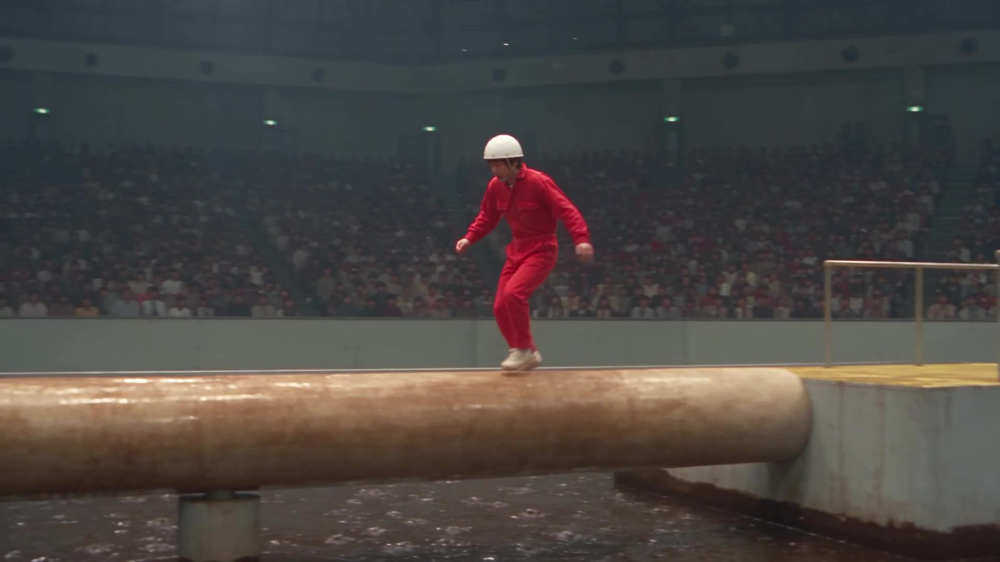

# 1980s Japanese Game-Show Obstacle Course Broadcast

A prompt for creating a 30-second video that mimics a classic 1980s Japanese game show with live-action footage and broadcast aesthetics.

**Category** · Cinematic & film scenes &nbsp;·&nbsp; **Position** · 001 of the atlas &nbsp;·&nbsp; **Source** · community pick

## Try it

- [Read the prompt page](https://callirra.com/seedance-prompt-library/1980s-japanese-game-show-obstacle-course-broadca) — the shot explained, with its settings
- [Open it in the generator](https://callirra.com/seedance2.5?atlas=1980s-japanese-game-show-obstacle-course-broadca&utm_source=github&utm_medium=atlas) — fills the prompt and every setting below; nothing is submitted until you press generate

## Clip

[](output.mp4)

[Watch the clip](output.mp4) — `output.mp4` in this folder, compressed from the original for the web. The same clip plays on [the prompt page](https://callirra.com/seedance-prompt-library/1980s-japanese-game-show-obstacle-course-broadca).

## Settings

| | |
|---|---|
| **Mode** | Text to video |
| **Duration** | 30s |
| **Resolution** | 720p |
| **Aspect ratio** | 16:9 |
| **Audio** | on |
| **Credits** | 1165 |

> These are a starting point rather than a record: the original settings were not published.

## Prompt

```text
Create a 30-second authentic 1980s Japanese game-show broadcast sequence inspired by classic Japanese obstacle-course television. Realistic live-action footage, broadcast-camera aesthetics, natural handheld movement, analog film grain, slightly washed
```

## Credit

**simeon-sanai** — [original](https://x.com/Naiknelofar788/status/2088690280979718295)

Licence: CC BY 4.0

The prompt and the clip above are theirs. We host a copy so this page keeps working if the original
goes away, and the link above points at the source. Rights holder and want it removed? Open an issue
and it comes down.


## Keywords

`cinematic` · `seedance 2.5 prompt` · `ai video prompt`

---

<sub>From the [Seedance 2.5 Prompt Atlas](https://callirra.com/seedance-prompt-library) · CC BY 4.0 · the credit figure is the live price the generator charges for exactly this configuration.</sub>
