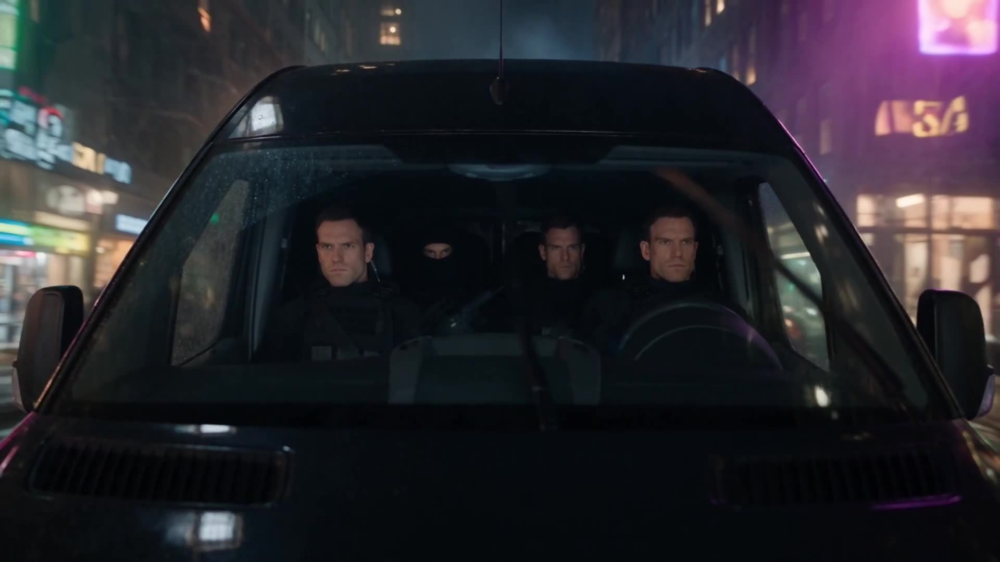

# Hollywood Needed A Crew For This. Your Agent

Hollywood needed a crew for this.

**Category** · Cinematic & film scenes &nbsp;·&nbsp; **Position** · 007 of the atlas &nbsp;·&nbsp; **Source** · community pick

## Try it

- [Read the prompt page](https://callirra.com/seedance-prompt-library/hollywood-needed-a-crew-for-this-your-agent) — the shot explained, with its settings
- [Open it in the generator](https://callirra.com/seedance2.5?atlas=hollywood-needed-a-crew-for-this-your-agent&utm_source=github&utm_medium=atlas) — fills the prompt and every setting below; nothing is submitted until you press generate

## Clip

[](output.mp4)

[Watch the clip](output.mp4) — `output.mp4` in this folder, compressed from the original for the web. The same clip plays on [the prompt page](https://callirra.com/seedance-prompt-library/hollywood-needed-a-crew-for-this-your-agent).

## Settings

| | |
|---|---|
| **Mode** | Text to video |
| **Duration** | 5s |
| **Resolution** | 720p |
| **Aspect ratio** | 16:9 |
| **Audio** | on |
| **Credits** | 195 |

> These are a starting point rather than a record: the original settings were not published.

## Prompt

```text
Hollywood needed a crew for this. Your agent only needs a prompt. We added Seedance 2.5 to AIsa, bringing cinematic video generation straight into your agent workflow. Action, lighting, motion, atmosphere. You describe the scene, Seedance handles the rest. One key. Pay only
```

## Credit

**Alsa** — [original](https://x.com/AIsaOneHQ/status/2085911580273696933)

Licence: CC BY 4.0

The prompt and the clip above are theirs. We host a copy so this page keeps working if the original
goes away, and the link above points at the source. Rights holder and want it removed? Open an issue
and it comes down.


## Keywords

`cinematic` · `seedance 2.5 prompt` · `ai video prompt`

---

<sub>From the [Seedance 2.5 Prompt Atlas](https://callirra.com/seedance-prompt-library) · CC BY 4.0 · the credit figure is the live price the generator charges for exactly this configuration.</sub>
