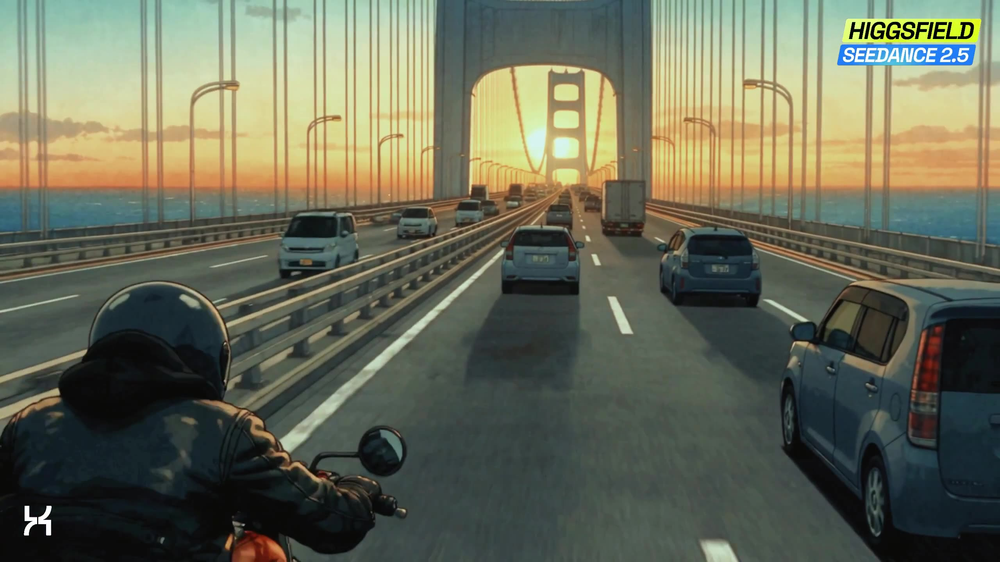

# Motorcyclist vs. Giant Octopus on Bridge

A cinematic action sequence of a lone motorcyclist trapped on a bridge as a giant octopus erupts from the water.

**Category** · Cinematic & film scenes &nbsp;·&nbsp; **Position** · 010 of the atlas &nbsp;·&nbsp; **Source** · community pick

## Try it

- [Read the prompt page](https://callirra.com/seedance-prompt-library/motorcyclist-vs-giant-octopus-on-bridge) — the shot explained, with its settings
- [Open it in the generator](https://callirra.com/seedance2.5?atlas=motorcyclist-vs-giant-octopus-on-bridge&utm_source=github&utm_medium=atlas) — fills the prompt and every setting below; nothing is submitted until you press generate

## Clip

[](output.mp4)

[Watch the clip](output.mp4) — `output.mp4` in this folder, compressed from the original for the web. The same clip plays on [the prompt page](https://callirra.com/seedance-prompt-library/motorcyclist-vs-giant-octopus-on-bridge).

## Settings

| | |
|---|---|
| **Mode** | Text to video |
| **Duration** | 30s |
| **Resolution** | 720p |
| **Aspect ratio** | 16:9 |
| **Audio** | on |
| **Credits** | 1165 |

> These are a starting point rather than a record: the original settings were not published.

## Prompt

```text
Generate a 30-second cinematic action sequence, one continuous visual narrative following KAITO, a lone motorcyclist, trapped on a busy two-way bridge when KYODAKO, a colossal octopus, suddenly erupts from the water and destroys the bridge.
```

## Credit

**harryskomi** — [original](https://x.com/HarrysKomi/status/2089899950134153457)

Licence: CC BY 4.0

The prompt and the clip above are theirs. We host a copy so this page keeps working if the original
goes away, and the link above points at the source. Rights holder and want it removed? Open an issue
and it comes down.


## Keywords

`cinematic` · `seedance 2.5 prompt` · `ai video prompt`

---

<sub>From the [Seedance 2.5 Prompt Atlas](https://callirra.com/seedance-prompt-library) · CC BY 4.0 · the credit figure is the live price the generator charges for exactly this configuration.</sub>
