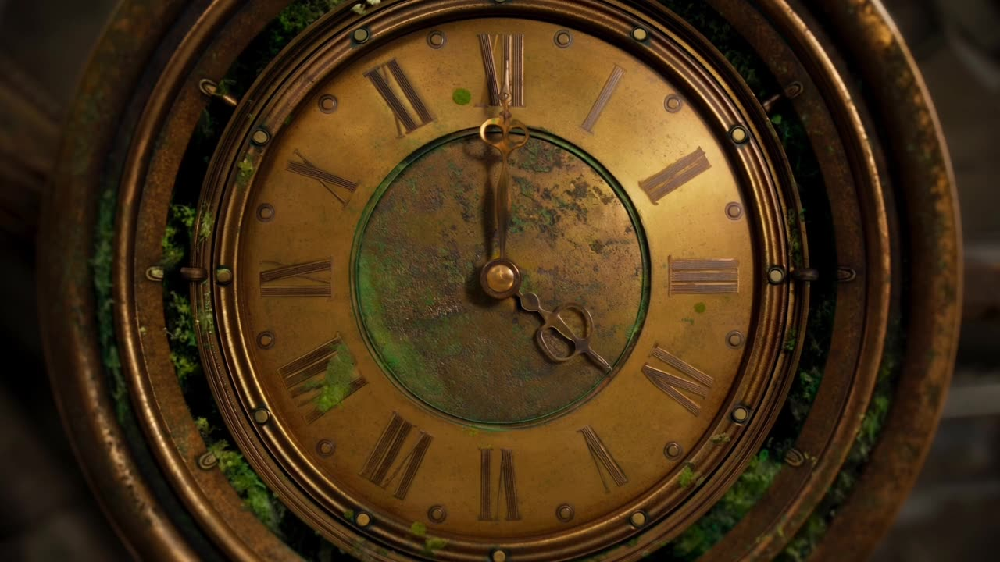

# Steampunk Clockwork — 30s One-Take

A 30-second steampunk miniature 3D sequence with continuous orbiting, pass-through camera moves.

**Category** · Cinematic & film scenes &nbsp;·&nbsp; **Position** · 022 of the atlas &nbsp;·&nbsp; **Source** · community pick

## Try it

- [Read the prompt page](https://callirra.com/seedance-prompt-library/steampunk-clockwork-30s-one-take) — the shot explained, with its settings
- [Open it in the generator](https://callirra.com/seedance2.5?atlas=steampunk-clockwork-30s-one-take&utm_source=github&utm_medium=atlas) — fills the prompt and every setting below; nothing is submitted until you press generate

## Clip

[](output.mp4)

[Watch the clip](output.mp4) — `output.mp4` in this folder, compressed from the original for the web. The same clip plays on [the prompt page](https://callirra.com/seedance-prompt-library/steampunk-clockwork-30s-one-take).

## Settings

| | |
|---|---|
| **Mode** | Text to video |
| **Duration** | 30s |
| **Resolution** | 720p |
| **Aspect ratio** | 16:9 |
| **Audio** | on |
| **Credits** | 1165 |

> These are a starting point rather than a record: the original settings were not published.

## Prompt

```text
A high-end, deeply cinematic 30-second 3D motion-graphics sequence in refined steampunk and vintage-miniature style, with continuous fluid orbiting and pass-through camera moves. [0-10s] Macro close-up of an antique brass clock face that unfolds layer by layer into meshing rotating gear rings and volumetric fog. The camera pierces down through the gears; a mechanical ornithopter spirals up from a miniature canyon of stacked weathered old books. [10-20s] The camera glides forward tracking the ornithopter, seamlessly passing into a fast-spinning ornate brass zoetrope projecting galloping mechanical-horse light. The light leaps out and the scene becomes a brass floating cable car on glimmering copper rails through a forest of gears, bathed in cinematic golden-hour light. [20-30s] The camera pans elegantly down; below appears an exquisite clockwork wooden sailing ship cutting deep-blue glass-textured waves, which morph into a glowing giant moon with lantern-holding explorer silhouettes trekking a crystal-vein ridge under stars. The camera spirals smoothly back through ethereal clouds to the ticking brass clock face. Hyper-real mechanical textures, rich brass and gold tones, cinematic shallow depth of field, smooth seamless pass-through camerawork, epic fantastical adventure atmosphere.
```

## Credit

**Volcengine Ark** — [original](https://ark.volcengine.com/promotion?modelName=seedance-2-5)

Licence: CC BY 4.0

The prompt and the clip above are theirs. We host a copy so this page keeps working if the original
goes away, and the link above points at the source. Rights holder and want it removed? Open an issue
and it comes down.


## Keywords

`cinematic` · `seedance 2.5 prompt` · `ai video prompt`

---

<sub>From the [Seedance 2.5 Prompt Atlas](https://callirra.com/seedance-prompt-library) · CC BY 4.0 · the credit figure is the live price the generator charges for exactly this configuration.</sub>
