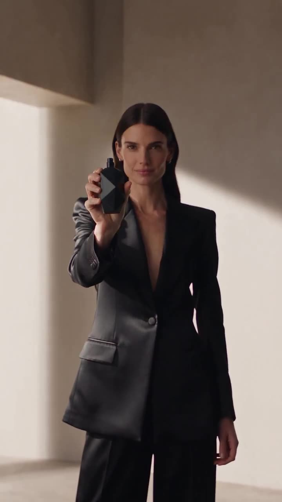

# Cinematic Luxury Perfume Commercial

A prompt for a cinematic commercial featuring an elegant woman presenting a sleek black perfume bottle in a minimalist studio.

**Category** · Product & commercial &nbsp;·&nbsp; **Position** · 031 of the atlas &nbsp;·&nbsp; **Source** · community pick

## Try it

- [Read the prompt page](https://callirra.com/seedance-prompt-library/cinematic-luxury-perfume-commercial) — the shot explained, with its settings
- [Open it in the generator](https://callirra.com/seedance2.5?atlas=cinematic-luxury-perfume-commercial&utm_source=github&utm_medium=atlas) — fills the prompt and every setting below; nothing is submitted until you press generate

## Clip

[](output.mp4)

[Watch the clip](output.mp4) — `output.mp4` in this folder, compressed from the original for the web. The same clip plays on [the prompt page](https://callirra.com/seedance-prompt-library/cinematic-luxury-perfume-commercial).

## Settings

| | |
|---|---|
| **Mode** | Text to video |
| **Duration** | 5s |
| **Resolution** | 720p |
| **Aspect ratio** | 16:9 |
| **Audio** | on |
| **Credits** | 195 |

> These are a starting point rather than a record: the original settings were not published.

## Prompt

```text
A cinematic luxury perfume commercial featuring an elegant woman in a minimalist studio wearing a sophisticated black outfit, presenting a sleek black perfume bottle to the camera; close-up macro shots highlight the bottle and spray nozzle
```

## Credit

**Talia** — [original](https://x.com/TaliaAariz/status/2097791048147677313)

Licence: CC BY 4.0

The prompt and the clip above are theirs. We host a copy so this page keeps working if the original
goes away, and the link above points at the source. Rights holder and want it removed? Open an issue
and it comes down.


## Keywords

`product commercial` · `seedance 2.5 prompt` · `ai video prompt`

---

<sub>From the [Seedance 2.5 Prompt Atlas](https://callirra.com/seedance-prompt-library) · CC BY 4.0 · the credit figure is the live price the generator charges for exactly this configuration.</sub>
