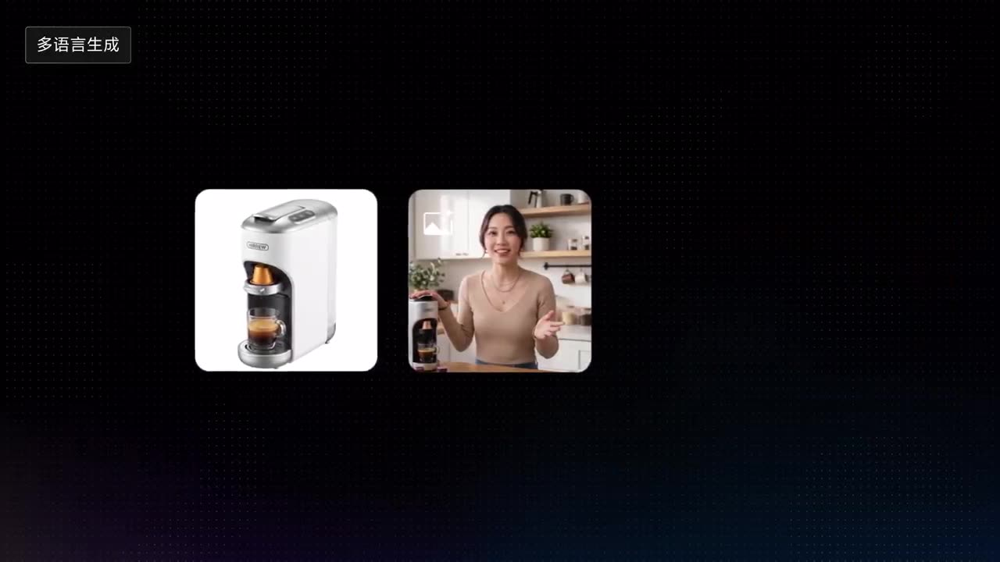

# Localization For Overseas Ads

Quickly produce multi-region versions by changing ethnicity, product, or copy while keeping shots and rhythm.

**Category** · Product & commercial &nbsp;·&nbsp; **Position** · 032 of the atlas &nbsp;·&nbsp; **Source** · community pick

## Try it

- [Read the prompt page](https://callirra.com/seedance-prompt-library/coffee-ad-localisation) — the shot explained, with its settings
- [Open it in the generator](https://callirra.com/seedance2.5?atlas=coffee-ad-localisation&utm_source=github&utm_medium=atlas) — fills the prompt and every setting below; nothing is submitted until you press generate

## Clip

[](output.mp4)

[Watch the clip](output.mp4) — `output.mp4` in this folder, compressed from the original for the web. The same clip plays on [the prompt page](https://callirra.com/seedance-prompt-library/coffee-ad-localisation).

## Settings

| | |
|---|---|
| **Mode** | Text to video |
| **Duration** | 12s |
| **Resolution** | 720p |
| **Aspect ratio** | 16:9 |
| **Audio** | on |
| **Credits** | 466 |

> These are a starting point rather than a record: the original settings were not published.

## Prompt

```text
@Image 1 is the product image, @Image 2 is the host and scene image. The host waves their hands in sync with the lines while speaking. The expression is genuine and natural.
0-2 seconds: Fixed shot of @Image 2, the host speaks to the camera in Chinese, the line is "The first cup of coffee in the morning, can't wait.".
(2–5s) Press the switch, fixed shot, the line is "Press once, coffee in 3 seconds."
(5–9s) Continue looking at the camera and speaking, the line is "Office, business trips, late-night work—freshly ground coffee always with you."
(9–12s) Look at the camera and speak, the line is "The lifesaver for workers, limited-time price drop."
Replace the person in the video with an American female, and change the copy voiceover to English.
Replace the person in the video with a Spanish male, and change the copy voiceover to Spanish.
Replace the person in the video with an Indonesian female, and change the copy voiceover to Indonesian.
Replace the person in the video with a Malaysian male, and change the copy voiceover to Malaysian.
```

## Credit

**ByteDance Seedance** — [original](https://github.com/AtlasCloudAI/awesome-seedance-2.5-prompts-skills/blob/main/i18n/README_zh.md)

Licence: CC BY 4.0

The prompt and the clip above are theirs. We host a copy so this page keeps working if the original
goes away, and the link above points at the source. Rights holder and want it removed? Open an issue
and it comes down.


## Keywords

`product commercial` · `seedance 2.5 prompt` · `ai video prompt`

---

<sub>From the [Seedance 2.5 Prompt Atlas](https://callirra.com/seedance-prompt-library) · CC BY 4.0 · the credit figure is the live price the generator charges for exactly this configuration.</sub>
