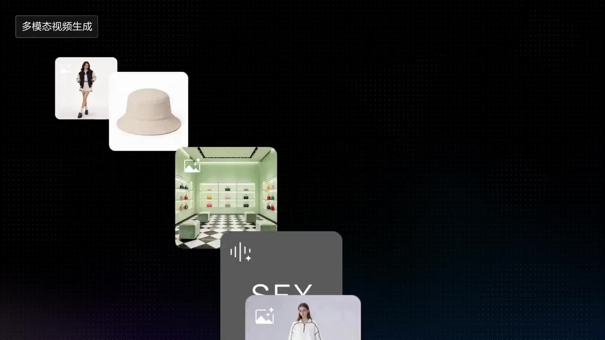

# Fashion Brand Short Film

Feeds multiple clothing, handbag, footwear items with model and scene references for free combination into multi-outfit, multi-scene fashion shots.

**Category** · Product & commercial &nbsp;·&nbsp; **Position** · 036 of the atlas &nbsp;·&nbsp; **Source** · community pick

## Try it

- [Read the prompt page](https://callirra.com/seedance-prompt-library/fashion-lookbook-relay) — the shot explained, with its settings
- [Open it in the generator](https://callirra.com/seedance2.5?atlas=fashion-lookbook-relay&utm_source=github&utm_medium=atlas) — fills the prompt and every setting below; nothing is submitted until you press generate

## Clip

[](output.mp4)

[Watch the clip](output.mp4) — `output.mp4` in this folder, compressed from the original for the web. The same clip plays on [the prompt page](https://callirra.com/seedance-prompt-library/fashion-lookbook-relay).

## Settings

| | |
|---|---|
| **Mode** | Text to video |
| **Duration** | 30s |
| **Resolution** | 720p |
| **Aspect ratio** | 16:9 |
| **Audio** | on |
| **Credits** | 1165 |

> These are a starting point rather than a record: the original settings were not published.

## Prompt

```text
Please generate a 30-second one-take video. Script: 6 models enter the frame one after another in a relay, the entire shot moves seamlessly through, with music beats switching outfits. @Image 1 wearing @Image 2 in the scene of @Image 3, sound effect reference @Audio 1. @Image 3 wearing @Image 4, wearing the hat from @Image 5, putting on @Image 6 sunglasses, walking out holding coffee, background is @Image 7 displaying @Image 8, sound effect reference @Audio 2. @Image 9 in the scene of @Image 10, wearing @Image 11 and @Image 12 striking a pose. @Image 13 carrying @Image 14, wearing @Image 15 walking in @Image 16, sound effect reference @Audio 3. @Image 17 wearing @Image 18 on head, carrying @Image 19, walking in @Image 20, sound effect reference @Audio 4. @Image 21 wearing @Image 22 walking the runway in @Image 23, sound effect reference @Audio 5.
```

## Credit

**ByteDance Seedance** — [original](https://github.com/AtlasCloudAI/awesome-seedance-2.5-prompts-skills/blob/main/i18n/README_zh.md)

Licence: CC BY 4.0

The prompt and the clip above are theirs. We host a copy so this page keeps working if the original
goes away, and the link above points at the source. Rights holder and want it removed? Open an issue
and it comes down.


## Keywords

`product commercial` · `seedance 2.5 prompt` · `ai video prompt`

---

<sub>From the [Seedance 2.5 Prompt Atlas](https://callirra.com/seedance-prompt-library) · CC BY 4.0 · the credit figure is the live price the generator charges for exactly this configuration.</sub>
