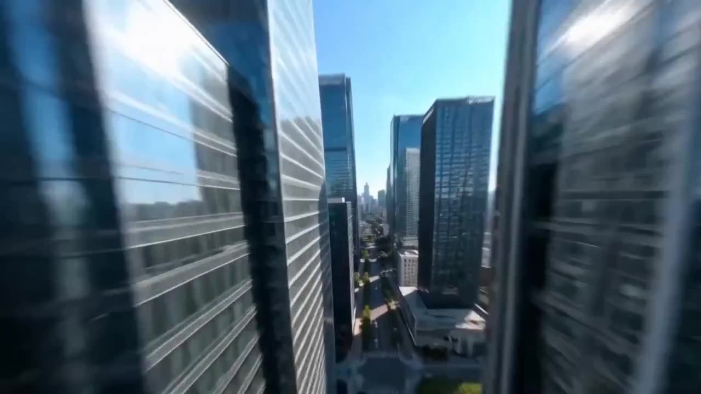

# Headphone Ad: Cinematic Motion And Rhythm Transfer

Create a headphone ad by transferring the camera work and editing rhythm from a reference video.

**Category** · Product & commercial &nbsp;·&nbsp; **Position** · 038 of the atlas &nbsp;·&nbsp; **Source** · community pick

## Try it

- [Read the prompt page](https://callirra.com/seedance-prompt-library/headphone-ad-transfer) — the shot explained, with its settings
- [Open it in the generator](https://callirra.com/seedance2.5?atlas=headphone-ad-transfer&utm_source=github&utm_medium=atlas) — fills the prompt and every setting below; nothing is submitted until you press generate

## Clip

[](output.mp4)

[Watch the clip](output.mp4) — `output.mp4` in this folder, compressed from the original for the web. The same clip plays on [the prompt page](https://callirra.com/seedance-prompt-library/headphone-ad-transfer).

## Settings

| | |
|---|---|
| **Mode** | Text to video |
| **Duration** | 5s |
| **Resolution** | 720p |
| **Aspect ratio** | 16:9 |
| **Audio** | on |
| **Credits** | 195 |

> These are a starting point rather than a record: the original settings were not published.

## Prompt

```text
Reference the camera movement techniques and editing rhythm of @Video 1 to generate an advertising short film for the headphones @Image. Adapt to scenes that match the product's tone, emphasizing modernity, simplicity, and a sense of technology. The switching points between product close-ups and scene panoramas are consistent with the original film, maintaining the same motion speed and transition methods.
```

## Credit

**ByteDance Seedance** — [original](https://github.com/AtlasCloudAI/awesome-seedance-2.5-prompts-skills/blob/main/i18n/README_zh.md)

Licence: CC BY 4.0

The prompt and the clip above are theirs. We host a copy so this page keeps working if the original
goes away, and the link above points at the source. Rights holder and want it removed? Open an issue
and it comes down.


## Keywords

`product commercial` · `seedance 2.5 prompt` · `ai video prompt`

---

<sub>From the [Seedance 2.5 Prompt Atlas](https://callirra.com/seedance-prompt-library) · CC BY 4.0 · the credit figure is the live price the generator charges for exactly this configuration.</sub>
