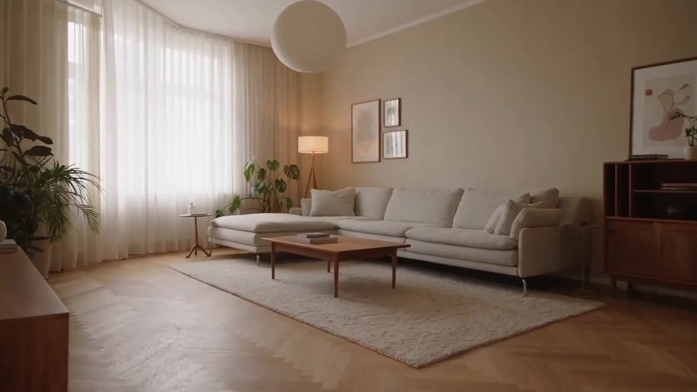

# Home Renovation Plan Demo

With a simple prompt, the model reinterprets new decor styles on the same space, switching materials, furniture, colors, and lighting while keeping layout and c

**Category** · Product & commercial &nbsp;·&nbsp; **Position** · 042 of the atlas &nbsp;·&nbsp; **Source** · community pick

## Try it

- [Read the prompt page](https://callirra.com/seedance-prompt-library/living-room-restyle) — the shot explained, with its settings
- [Open it in the generator](https://callirra.com/seedance2.5?atlas=living-room-restyle&utm_source=github&utm_medium=atlas) — fills the prompt and every setting below; nothing is submitted until you press generate

## Clip

[](output.mp4)

[Watch the clip](output.mp4) — `output.mp4` in this folder, compressed from the original for the web. The same clip plays on [the prompt page](https://callirra.com/seedance-prompt-library/living-room-restyle).

## Settings

| | |
|---|---|
| **Mode** | Text to video |
| **Duration** | 5s |
| **Resolution** | 720p |
| **Aspect ratio** | 16:9 |
| **Audio** | on |
| **Credits** | 195 |

> These are a starting point rather than a record: the original settings were not published.

## Prompt

```text
Use the input video as the exact source and preserve the original camera movement, timing, composition, room layout, lighting, shadows, furniture positions, and all objects.
Only edit two materials in the living room:
1. Replace the light fabric sofa on the right side of the room with a rich brown leather sofa. Keep the exact same sofa shape, size, position, cushion layout, armrests, backrest, and perspective. The new sofa should look like realistic brown leather, with natural leather grain, subtle wrinkles, stitching, soft glossy highlights, and physically believable reflections from the window light.

2. Replace the visible warm wooden floor with polished white marble flooring. Keep the exact same floor plane, perspective, scale, and room geometry. The marble should be white to light gray with natural subtle veins, realistic seams, and controlled polished reflections. The marble reflections should respond to the window light, furniture legs, plants, sofa base, and room shadows.

Everything else must remain unchanged: the window, curtains, walls, wall art, TV, TV console, plants, rug, coffee table, books, radiator, shelves, doorframe, lighting, shadows, camera motion, and overall warm interior atmosphere. The rug and coffee table stay exactly where they are, on top of the new marble floor. The edit should look like a realistic interior renovation, not a new generated room.

Maintain temporal consistency across the full video. The sofa and floor materials must remain stable from frame to frame with no flickering, warping, melting, or object changes. Preserve the original video’s natural daylight, warm tone, soft shadows, lens behavior, and smooth camera movement.
Negative Prompt
Do not change the room layout. Do not move furniture. Do not add or remove objects. Do not change the rug, coffee table, TV, plants, curtains, window, wall art, shelves, radiator, or doorframe. Do not change the camera movement. Do not change the sofa shape or size. Do not make the leather look plastic. Do not make the marble overly reflective like a mirror. Do not create broken or chaotic marble veins. Do not replace the rug with marble. Do not alter the walls or ceiling. No people, no text, no logo, no UI, no selection mask, no fantasy effect, no melting transition, no flickering.
```

## Credit

**ByteDance Seedance** — [original](https://github.com/AtlasCloudAI/awesome-seedance-2.5-prompts-skills/blob/main/i18n/README_zh.md)

Licence: CC BY 4.0

The prompt and the clip above are theirs. We host a copy so this page keeps working if the original
goes away, and the link above points at the source. Rights holder and want it removed? Open an issue
and it comes down.


## Keywords

`product commercial` · `seedance 2.5 prompt` · `ai video prompt`

---

<sub>From the [Seedance 2.5 Prompt Atlas](https://callirra.com/seedance-prompt-library) · CC BY 4.0 · the credit figure is the live price the generator charges for exactly this configuration.</sub>
