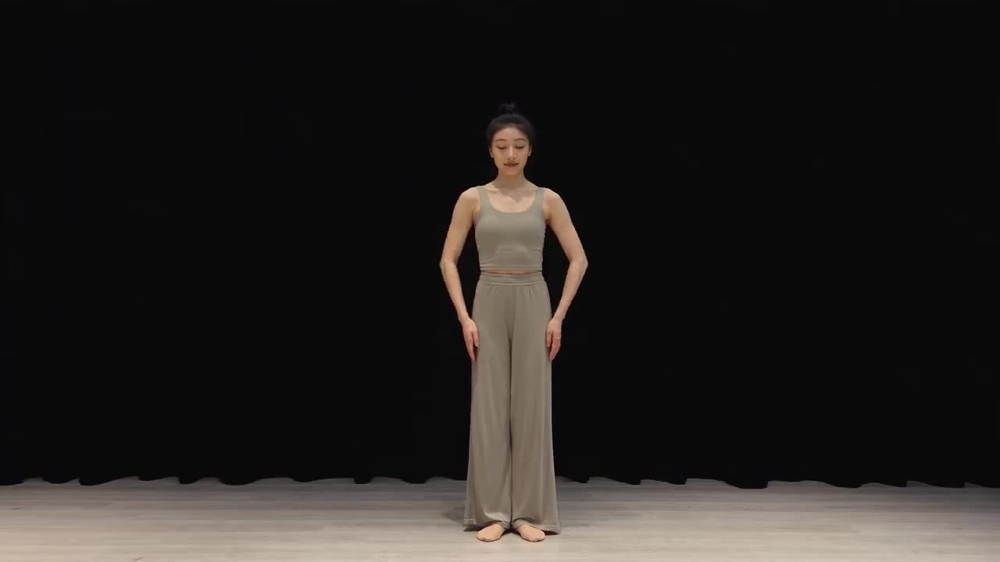

# Dance Motion Transfer

Using a real dancer's motion video as reference, precisely transfer the movements to a target character, aligning motion paths, rhythm, and limb details while r

**Category** · Dance & music video &nbsp;·&nbsp; **Position** · 065 of the atlas &nbsp;·&nbsp; **Source** · community pick

## Try it

- [Read the prompt page](https://callirra.com/seedance-prompt-library/dunhuang-dance-transfer) — the shot explained, with its settings
- [Open it in the generator](https://callirra.com/seedance2.5?atlas=dunhuang-dance-transfer&utm_source=github&utm_medium=atlas) — fills the prompt and every setting below; nothing is submitted until you press generate

## Clip

[](output.mp4)

[Watch the clip](output.mp4) — `output.mp4` in this folder, compressed from the original for the web. The same clip plays on [the prompt page](https://callirra.com/seedance-prompt-library/dunhuang-dance-transfer).

## Settings

| | |
|---|---|
| **Mode** | Text to video |
| **Duration** | 5s |
| **Resolution** | 720p |
| **Aspect ratio** | 16:9 |
| **Audio** | on |
| **Credits** | 195 |

> These are a starting point rather than a record: the original settings were not published.

## Prompt

```text
Referencing the character movements in @Video 1, generate a dance video featuring a character wearing Dunhuang-style attire in front of the Mogao Caves.
```

## Credit

**ByteDance Seedance** — [original](https://github.com/AtlasCloudAI/awesome-seedance-2.5-prompts-skills/blob/main/i18n/README_zh.md)

Licence: CC BY 4.0

The prompt and the clip above are theirs. We host a copy so this page keeps working if the original
goes away, and the link above points at the source. Rights holder and want it removed? Open an issue
and it comes down.


## Keywords

`dance music` · `seedance 2.5 prompt` · `ai video prompt`

---

<sub>From the [Seedance 2.5 Prompt Atlas](https://callirra.com/seedance-prompt-library) · CC BY 4.0 · the credit figure is the live price the generator charges for exactly this configuration.</sub>
