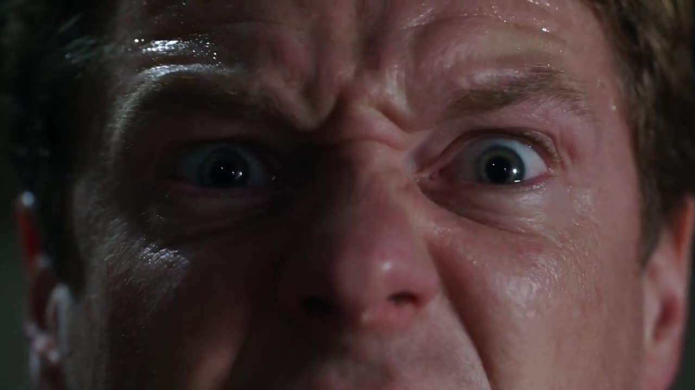

# Hollywood Creature Transformation Short Film

A prompt for a cinematic short film featuring a dramatic creature transformation with quick intercuts and slow-motion action beats.

**Category** · Nature & landscapes &nbsp;·&nbsp; **Position** · 077 of the atlas &nbsp;·&nbsp; **Source** · community pick

## Try it

- [Read the prompt page](https://callirra.com/seedance-prompt-library/hollywood-creature-transformation-short-film) — the shot explained, with its settings
- [Open it in the generator](https://callirra.com/seedance2.5?atlas=hollywood-creature-transformation-short-film&utm_source=github&utm_medium=atlas) — fills the prompt and every setting below; nothing is submitted until you press generate

## Clip

[](output.mp4)

[Watch the clip](output.mp4) — `output.mp4` in this folder, compressed from the original for the web. The same clip plays on [the prompt page](https://callirra.com/seedance-prompt-library/hollywood-creature-transformation-short-film).

## Settings

| | |
|---|---|
| **Mode** | Text to video |
| **Duration** | 5s |
| **Resolution** | 720p |
| **Aspect ratio** | 16:9 |
| **Audio** | on |
| **Credits** | 195 |

> These are a starting point rather than a record: the original settings were not published.

## Prompt

```text
Cinematic Hollywood-style creature-transformation short film, dramatic and emotionally grounded, edited in quick intercut segments with strategic slow-motion beats during key action moments. > [0-3s] Close-up on a man's face in a dark forest
```

## Credit

**auqib** — [original](https://x.com/auqibhabib/status/2098103270086725812)

Licence: CC BY 4.0

The prompt and the clip above are theirs. We host a copy so this page keeps working if the original
goes away, and the link above points at the source. Rights holder and want it removed? Open an issue
and it comes down.


## Keywords

`nature landscape` · `seedance 2.5 prompt` · `ai video prompt`

---

<sub>From the [Seedance 2.5 Prompt Atlas](https://callirra.com/seedance-prompt-library) · CC BY 4.0 · the credit figure is the live price the generator charges for exactly this configuration.</sub>
