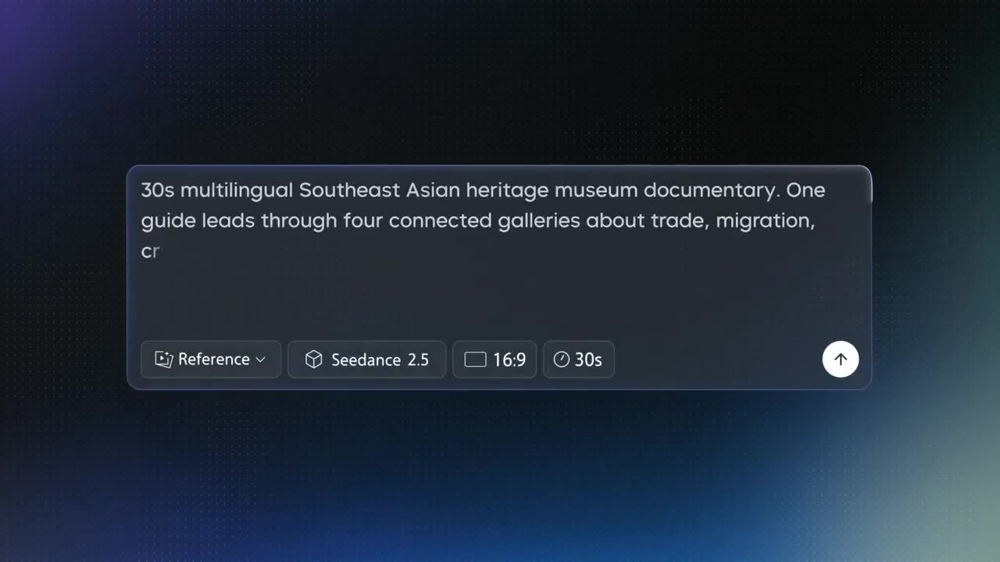

# Maritime Museum Multilingual Narration

One guide moves through different exhibits, naturally switching between English, Singapore-accented Mandarin, Malay, and Japanese.

**Category** · Nature & landscapes &nbsp;·&nbsp; **Position** · 080 of the atlas &nbsp;·&nbsp; **Source** · community pick

## Try it

- [Read the prompt page](https://callirra.com/seedance-prompt-library/maritime-museum-multilingual-tour) — the shot explained, with its settings
- [Open it in the generator](https://callirra.com/seedance2.5?atlas=maritime-museum-multilingual-tour&utm_source=github&utm_medium=atlas) — fills the prompt and every setting below; nothing is submitted until you press generate

## Clip

[](output.mp4)

[Watch the clip](output.mp4) — `output.mp4` in this folder, compressed from the original for the web. The same clip plays on [the prompt page](https://callirra.com/seedance-prompt-library/maritime-museum-multilingual-tour).

## Settings

| | |
|---|---|
| **Mode** | Text to video |
| **Duration** | 30s |
| **Resolution** | 720p |
| **Aspect ratio** | 16:9 |
| **Audio** | on |
| **Credits** | 1165 |

> These are a starting point rather than a record: the original settings were not published.

## Prompt

```text
30s multilingual Southeast Asian heritage museum documentary. One guide leads through four connected galleries about trade, migration, craft, and Singapore's regional history. Warm, authentic museum realism, not tourism advertising.
0-7.5s Port Model Gallery, English.Singapore harbor and Malacca Strait model, moving ship lights, blue map wall. Guide: "Singapore has always been a meeting point, not just a destination."
7.5-15s Ceramics & Spice Room, Mandarin.Blue-white porcelain, spice jars, cinnamon, cloves, pepper, wooden crates, warm light. Guide: "These ceramics and spices record a way of life that grew from the sea."
15-22.5s Malacca Trade Gallery, Malay.Teak walls, ship model, batik, pewter, route maps, brass lanterns. Guide: "Di Selat Melaka, kapal, rempah dan bahasa bertemu. Perdagangan menghubungkan banyak budaya."
22.5-30s Travel Objects Gallery, Japanese.Suitcases, letters, textiles, family photos in glass cases, soft paper light. Guide: "旅の品物は、場所を移すたびに、新しい意味を持ちます。"
Camera: 16:9 warm documentary style, slow museum walkthrough, guide moments mixed with object close-ups.
```

## Credit

**ByteDance Seedance** — [original](https://github.com/AtlasCloudAI/awesome-seedance-2.5-prompts-skills#category-30)

Licence: CC BY 4.0

The prompt and the clip above are theirs. We host a copy so this page keeps working if the original
goes away, and the link above points at the source. Rights holder and want it removed? Open an issue
and it comes down.


## Keywords

`nature landscape` · `seedance 2.5 prompt` · `ai video prompt`

---

<sub>From the [Seedance 2.5 Prompt Atlas](https://callirra.com/seedance-prompt-library) · CC BY 4.0 · the credit figure is the live price the generator charges for exactly this configuration.</sub>
