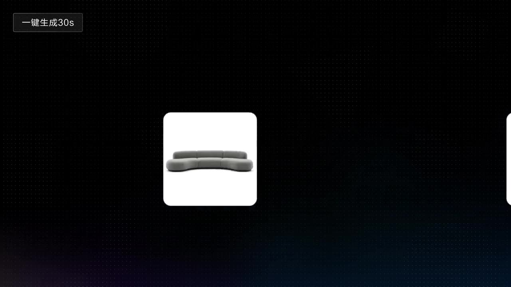

# Live-Action TV Commercial

A single 30s vertical ad fully carrying brand narrative from product details to scene performance.

**Category** · Animals & pets &nbsp;·&nbsp; **Position** · 094 of the atlas &nbsp;·&nbsp; **Source** · community pick

## Try it

- [Read the prompt page](https://callirra.com/seedance-prompt-library/live-action-tv-commercial) — the shot explained, with its settings
- [Open it in the generator](https://callirra.com/seedance2.5?atlas=live-action-tv-commercial&utm_source=github&utm_medium=atlas) — fills the prompt and every setting below; nothing is submitted until you press generate

## Clip

[](output.mp4)

[Watch the clip](output.mp4) — `output.mp4` in this folder, compressed from the original for the web. The same clip plays on [the prompt page](https://callirra.com/seedance-prompt-library/live-action-tv-commercial).

## Settings

| | |
|---|---|
| **Mode** | Text to video |
| **Duration** | 30s |
| **Resolution** | 720p |
| **Aspect ratio** | 9:16 |
| **Audio** | on |
| **Credits** | 1165 |

> These are a starting point rather than a record: the original settings were not published.

## Prompt

```text
Produce a 30-second vertical home furnishing advertisement. The main product is a light gray-green modular sectional sofa with rounded curved lines, low thick cushions, paired with a beige blanket and brown pillows. The first 15 seconds are a pure white seamless studio product showcase: the sofa is displayed completely, the camera slowly pushes in close, pans horizontally, and moves laterally to show the outline and form, finally pulling back to a full shot and freeze. Lighting is even and soft, background is pure white and clean, no sweeping lights, no flash whites. The last 15 seconds transition into a warm-lit living room at dusk: the hostess, wearing beige knit loungewear, sits on the sofa reading a book, legs on the beige blanket; she gently places a coffee cup, a cat jumps onto the sofa; a child runs in and leans on her shoulder, the hostess looks down and smiles; at night, a floor lamp lights up, the three quietly lean on the sofa, the camera slowly pulls back and freezes, leaving space for the brand logo. The overall style is restrained, gentle, clean, with authentic and natural visuals.
```

## Credit

**ByteDance Seedance**

Licence: CC BY 4.0

The prompt and the clip above are theirs. We host a copy so this page keeps working if the original
goes away, and the link above points at the source. Rights holder and want it removed? Open an issue
and it comes down.


## Keywords

`animals pets` · `seedance 2.5 prompt` · `ai video prompt`

---

<sub>From the [Seedance 2.5 Prompt Atlas](https://callirra.com/seedance-prompt-library) · CC BY 4.0 · the credit figure is the live price the generator charges for exactly this configuration.</sub>
