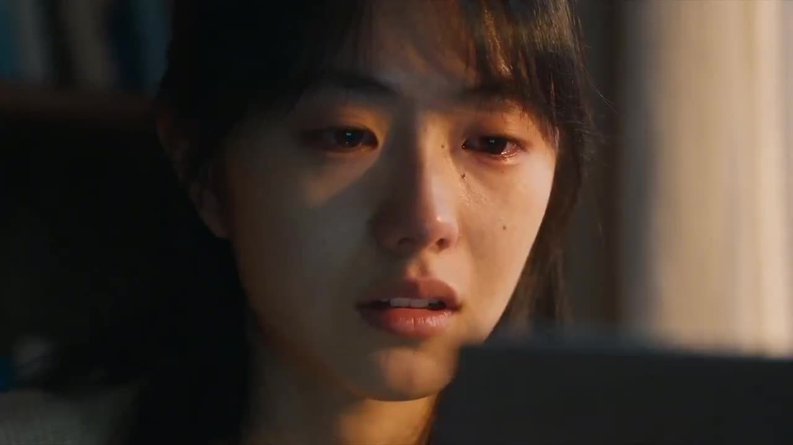

# Acceptance Letter's Quiet Joy

A young woman experiences restrained, complex emotions upon receiving her acceptance letter at dusk.

**Category** · VFX & sci-fi &nbsp;·&nbsp; **Position** · 109 of the atlas &nbsp;·&nbsp; **Source** · community pick

## Try it

- [Read the prompt page](https://callirra.com/seedance-prompt-library/acceptance-letter-s-quiet-joy) — the shot explained, with its settings
- [Open it in the generator](https://callirra.com/seedance2.5?atlas=acceptance-letter-s-quiet-joy&utm_source=github&utm_medium=atlas) — fills the prompt and every setting below; nothing is submitted until you press generate

## Clip

[](output.mp4)

[Watch the clip](output.mp4) — `output.mp4` in this folder, compressed from the original for the web. The same clip plays on [the prompt page](https://callirra.com/seedance-prompt-library/acceptance-letter-s-quiet-joy).

## Settings

| | |
|---|---|
| **Mode** | Text to video |
| **Duration** | 5s |
| **Resolution** | 720p |
| **Aspect ratio** | 16:9 |
| **Audio** | on |
| **Credits** | 195 |

> These are a starting point rather than a record: the original settings were not published.

## Prompt

```text
A young East Asian woman sits by a study window at dusk, facing a laptop, warm golden side/back light on her face. Her performance is deeply restrained, with emotion conveyed through her eyes, shallow breathing, a choked throat, and trembling fingertips. She moves from disbelief to tearful suspension; as one tear falls, a faint smile appears, ending in quiet relief as she looks outside. Slow, steady camera movement, close-ups for micro-expressions, a slight push-in at the moment the tear gives way to a smile, soft focus on " Acceptance Letter," 35mm film texture, shallow depth of field, low-light grain.
```

## Credit

**ByteDance Seedance**

Licence: CC BY 4.0

The prompt and the clip above are theirs. We host a copy so this page keeps working if the original
goes away, and the link above points at the source. Rights holder and want it removed? Open an issue
and it comes down.


## Keywords

`vfx scifi` · `seedance 2.5 prompt` · `ai video prompt`

---

<sub>From the [Seedance 2.5 Prompt Atlas](https://callirra.com/seedance-prompt-library) · CC BY 4.0 · the credit figure is the live price the generator charges for exactly this configuration.</sub>
