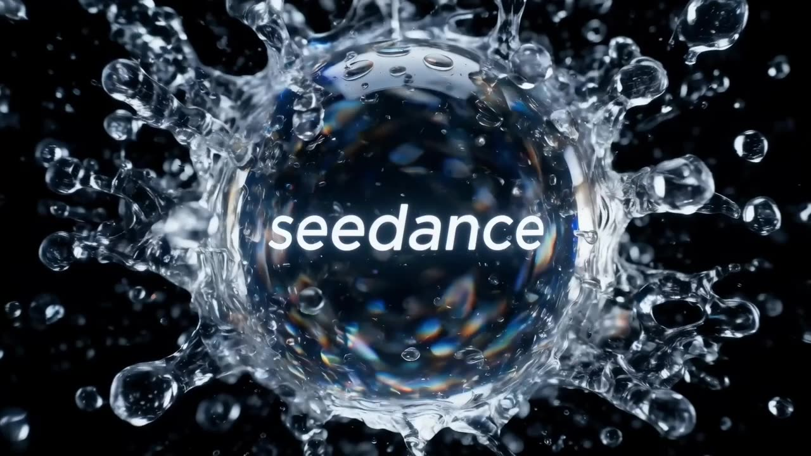

# Crystal Ball Match-Cut Beat Film

A beat-synced match-cut film: one crystal ball etched with a glowing 'seedance' logo stays centered while eight scenes cut seamlessly behind it.

**Category** · VFX & sci-fi &nbsp;·&nbsp; **Position** · 112 of the atlas &nbsp;·&nbsp; **Source** · community pick

## Try it

- [Read the prompt page](https://callirra.com/seedance-prompt-library/crystal-ball-match-cut-beat-film) — the shot explained, with its settings
- [Open it in the generator](https://callirra.com/seedance2.5?atlas=crystal-ball-match-cut-beat-film&utm_source=github&utm_medium=atlas) — fills the prompt and every setting below; nothing is submitted until you press generate

## Clip

[](output.mp4)

[Watch the clip](output.mp4) — `output.mp4` in this folder, compressed from the original for the web. The same clip plays on [the prompt page](https://callirra.com/seedance-prompt-library/crystal-ball-match-cut-beat-film).

## Settings

| | |
|---|---|
| **Mode** | Text to video |
| **Duration** | 5s |
| **Resolution** | 720p |
| **Aspect ratio** | 16:9 |
| **Audio** | on |
| **Credits** | 195 |

> These are a starting point rather than a record: the original settings were not published.

## Prompt

```text
A fast-paced, cinematic Match-cut short film synced to a driving electronic beat. A flawless crystal ball stays fixed dead-center throughout, a glowing "seedance" logo etched inside it. The ball holds razor-sharp focus while, on every strong musical beat, the background match-cuts seamlessly: Scene 1: macro close-up, cinematic water splashing around the ball, refracting intricate light. Scene 2: a vintage morning cafe, the ball on a raw-wood table, rising coffee steam and blurred commuters beyond the window. Scene 3: golden-hour dusk, a skater youth tosses and catches the ball one-handed, street racing backward behind them in gorgeous backlit sunset. Scene 4: a frenzied music festival, hands raise the ball high, refracting dazzling stage lasers. Scene 5: a lively family party table, the ball resting center-frame, blurred figures toasting and reaching for food. Scene 6: a dim cinema, hands cupping the ball as the giant screen's faint glow drifts across its surface. Scene 7: the ball on a violently vibrating speaker diaphragm, match-cutting on the climax to a spinning DJ turntable center. Scene 8: an outdoor camping night, background becoming warm bonfire and swaying string-light bokeh. Finale: on the final downbeat the ball is hurled up out of frame; cut to pure black, a minimal white-on-black "seedance" appearing dead-center. Beat-synced match-cut editing, top-tier cinematic color grading, photoreal glass refraction, ray tracing, global illumination. Subject razor-sharp, background heavy motion blur.
```

## Credit

**Volcengine Ark** — [original](https://ark.volcengine.com/promotion?modelName=seedance-2-5)

Licence: CC BY 4.0

The prompt and the clip above are theirs. We host a copy so this page keeps working if the original
goes away, and the link above points at the source. Rights holder and want it removed? Open an issue
and it comes down.


## Keywords

`vfx scifi` · `seedance 2.5 prompt` · `ai video prompt`

---

<sub>From the [Seedance 2.5 Prompt Atlas](https://callirra.com/seedance-prompt-library) · CC BY 4.0 · the credit figure is the live price the generator charges for exactly this configuration.</sub>
