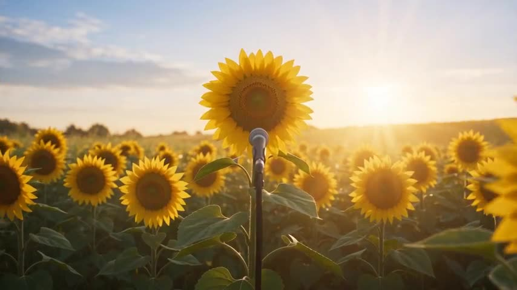

# Personified IP Character Film

Anthropomorphic characters seamlessly blend with real scenes, maintaining consistent appearance, actions, and accent throughout, bringing imagined roles into re

**Category** · Historical & fantasy &nbsp;·&nbsp; **Position** · 121 of the atlas &nbsp;·&nbsp; **Source** · community pick

## Try it

- [Read the prompt page](https://callirra.com/seedance-prompt-library/anthropomorphic-ip-characters) — the shot explained, with its settings
- [Open it in the generator](https://callirra.com/seedance2.5?atlas=anthropomorphic-ip-characters&utm_source=github&utm_medium=atlas) — fills the prompt and every setting below; nothing is submitted until you press generate

## Clip

[](output.mp4)

[Watch the clip](output.mp4) — `output.mp4` in this folder, compressed from the original for the web. The same clip plays on [the prompt page](https://callirra.com/seedance-prompt-library/anthropomorphic-ip-characters).

## Settings

| | |
|---|---|
| **Mode** | Text to video |
| **Duration** | 5s |
| **Resolution** | 720p |
| **Aspect ratio** | 16:9 |
| **Audio** | on |
| **Credits** | 195 |

> These are a starting point rather than a record: the original settings were not published.

## Prompt

```text
In a medium shot, personified sunflowers form a unique botanical band, with plants neatly arranged. Warm sunlight pours down, making the golden petals bright and vivid under the light and shadow. A breeze sweeps through the flower patch, causing the leaves to sway gently, accompanied by faint rustling sounds. The sunflower at the front of the group has a standing microphone set up before it. It uses its right "hand" leaf to press down and adjust the microphone to a suitable height, speaking in a deep, gentle British accent: "Partners, let's spread beauty through song." The other sunflowers each hold different instruments and begin to play: some use their leaves to beat a round drum, some carry guitars, and others play wind instruments, each performing their role in perfect harmony. The lead sunflower straightens its posture, faces the microphone directly, extends a leaf to clap overhead in rhythm, ready to start singing.
American Western film style. A scorching sun, yellow sand, a small town. An orange cat wearing a miniature cowboy hat and a fringed leather vest pushes open a door, the door hinge creaking and stirring up dust. The camera quickly pushes in: the bearded bartender wiping a glass behind the counter sees the cat, his hand jerks, and the glass shatters on the floor; three cowboys in the corner turn their heads simultaneously, their tobacco-chewing mouths freeze, close-up on their widened eyes and twitching mustaches, background with three "whoosh" whip crack sound effects. The camera returns to a medium shot of the cat. It kicks up dust from the wooden floor with its hind paw, lifts its chin, and says in a fierce yet drawn-out tone with an American accent: "Fresh milk, brother. Ain't nobody gonna greet me?" The entire room falls silent for half a second, then the cowboys all take off their hats in unison, letting out a drawn-out "Whoa—" of amazement, harmonica slide sound rising. The camera does a 360°环绕 shot around the cat, showing it walking to the bar, jumping onto a high stool, and its proud, sassy little expression.
```

## Credit

**ByteDance Seedance** — [original](https://github.com/AtlasCloudAI/awesome-seedance-2.5-prompts-skills/blob/main/i18n/README_zh.md)

Licence: CC BY 4.0

The prompt and the clip above are theirs. We host a copy so this page keeps working if the original
goes away, and the link above points at the source. Rights holder and want it removed? Open an issue
and it comes down.


## Keywords

`historical fantasy` · `seedance 2.5 prompt` · `ai video prompt`

---

<sub>From the [Seedance 2.5 Prompt Atlas](https://callirra.com/seedance-prompt-library) · CC BY 4.0 · the credit figure is the live price the generator charges for exactly this configuration.</sub>
