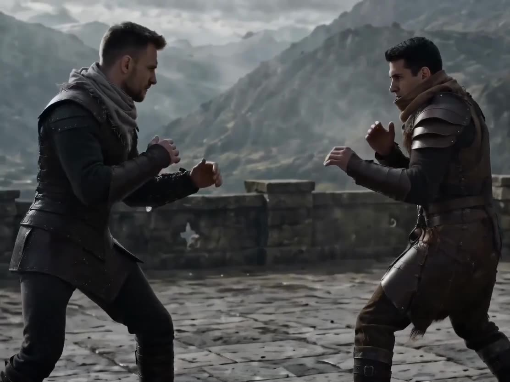

# Martial Scene Swap: Cold Weapon Duel

Replace a bare-handed fight with a cold weapon duel in a classical, atmospheric setting.

**Category** · Historical & fantasy &nbsp;·&nbsp; **Position** · 124 of the atlas &nbsp;·&nbsp; **Source** · community pick

## Try it

- [Read the prompt page](https://callirra.com/seedance-prompt-library/cold-weapon-duel-restage) — the shot explained, with its settings
- [Open it in the generator](https://callirra.com/seedance2.5?atlas=cold-weapon-duel-restage&utm_source=github&utm_medium=atlas) — fills the prompt and every setting below; nothing is submitted until you press generate

## Clip

[](output.mp4)

[Watch the clip](output.mp4) — `output.mp4` in this folder, compressed from the original for the web. The same clip plays on [the prompt page](https://callirra.com/seedance-prompt-library/cold-weapon-duel-restage).

## Settings

| | |
|---|---|
| **Mode** | Text to video |
| **Duration** | 5s |
| **Resolution** | 720p |
| **Aspect ratio** | 16:9 |
| **Audio** | on |
| **Credits** | 195 |

> These are a starting point rather than a record: the original settings were not published.

## Prompt

```text
Replace the bare-handed fight video of two people @Video 1 with the empty-handed probing style before a cold weapon duel.
Replace the scene with a medieval stone castle platform, ancient courtyard flat ground, mountain fortress outer platform, or simple stone brick dueling ground, with a background of ancient castle walls, wind, fog, distant mountain lines, and flat stone ground @Image 1.
Replace the clothing of the man in dark clothes in the video with @Image 2, and replace the man in light clothes with @Image 3. Keep the actions unchanged, do not alter the original rhythm.
AI effects only enhance environment and texture: wind blowing clothes, light fog, a small amount of dust at contact points, cold metallic reflective texture, slight grain, and epic color grading. Overall style is restrained, realistic, classical hardcore duel atmosphere. Background music hits the beat.
```

## Credit

**ByteDance Seedance** — [original](https://github.com/AtlasCloudAI/awesome-seedance-2.5-prompts-skills/blob/main/i18n/README_zh.md)

Licence: CC BY 4.0

The prompt and the clip above are theirs. We host a copy so this page keeps working if the original
goes away, and the link above points at the source. Rights holder and want it removed? Open an issue
and it comes down.


## Keywords

`historical fantasy` · `seedance 2.5 prompt` · `ai video prompt`

---

<sub>From the [Seedance 2.5 Prompt Atlas](https://callirra.com/seedance-prompt-library) · CC BY 4.0 · the credit figure is the live price the generator charges for exactly this configuration.</sub>
