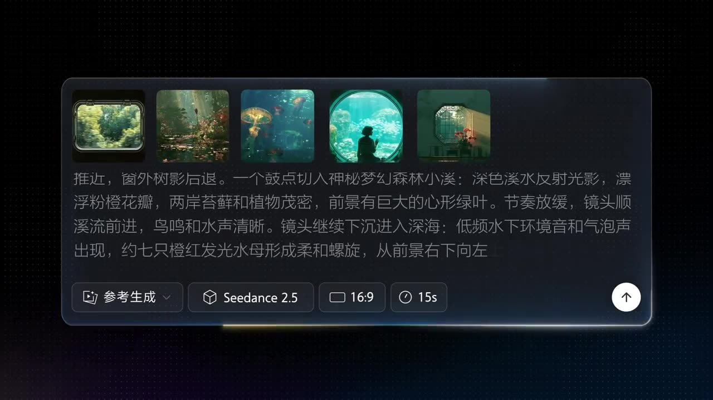

# Concept Short Film

Multiple dreamlike scenes flow seamlessly within a single 30s shot, unified in atmosphere, lighting, and narrative tone.

**Category** · Historical & fantasy &nbsp;·&nbsp; **Position** · 127 of the atlas &nbsp;·&nbsp; **Source** · community pick

## Try it

- [Read the prompt page](https://callirra.com/seedance-prompt-library/dream-concept-short) — the shot explained, with its settings
- [Open it in the generator](https://callirra.com/seedance2.5?atlas=dream-concept-short&utm_source=github&utm_medium=atlas) — fills the prompt and every setting below; nothing is submitted until you press generate

## Clip

[](output.mp4)

[Watch the clip](output.mp4) — `output.mp4` in this folder, compressed from the original for the web. The same clip plays on [the prompt page](https://callirra.com/seedance-prompt-library/dream-concept-short).

## Settings

| | |
|---|---|
| **Mode** | Text to video |
| **Duration** | 5s |
| **Resolution** | 720p |
| **Aspect ratio** | 16:9 |
| **Audio** | on |
| **Credits** | 195 |

> These are a starting point rather than a record: the original settings were not published.

## Prompt

```text
Cinematic brand concept short film. @Image 1 as the first frame, the image slightly shaky, the lens gradually pushes in, arriving at the rapidly receding tree shadows outside the window, the speed of the shadows receding faster and faster, suddenly cuts to @Image 2, the speed suddenly slows, the lens follows the stream slowly forward, birdsong and floral fragrance.
The lens moves down, underwater, sound effects include the sound of bubbles in water, a group of orange jellyfish swim gracefully past the lens @Image 3, the lens slowly pulls back, a school of small fish flashes past the lens and then swims from the water into the room through the window @Image 4, a girl looks left and right, admiring the small fish.
The lens slowly pulls back, the image goes out of focus, then refocuses and becomes clear again, switching with the music rhythm: Chinese garden lattice window @Image 5 light circles, church stained glass window, airplane porthole, dome skylight, bay window, Venetian blinds, European dormer window, door peephole, camera viewfinder, bird's eye, human eye close-up.
The image stays on the human eye close-up, then the eye closes, the screen goes black, then suddenly opens, the word "seedance" with a heavy accent appears in the center of the eye.
```

## Credit

**ByteDance Seedance** — [original](https://github.com/AtlasCloudAI/awesome-seedance-2.5-prompts-skills/blob/main/i18n/README_zh.md)

Licence: CC BY 4.0

The prompt and the clip above are theirs. We host a copy so this page keeps working if the original
goes away, and the link above points at the source. Rights holder and want it removed? Open an issue
and it comes down.


## Keywords

`historical fantasy` · `seedance 2.5 prompt` · `ai video prompt`

---

<sub>From the [Seedance 2.5 Prompt Atlas](https://callirra.com/seedance-prompt-library) · CC BY 4.0 · the credit figure is the live price the generator charges for exactly this configuration.</sub>
