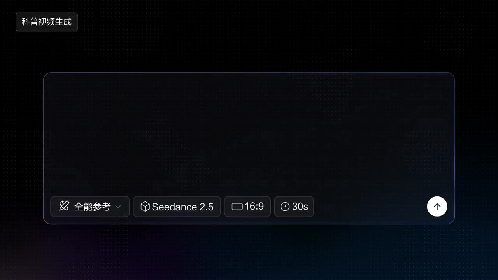

# Children's Science Animation

A Chinese-style illustrated scroll unfolds with narration, the visuals continuously expanding with the story.

**Category** · Historical & fantasy &nbsp;·&nbsp; **Position** · 128 of the atlas &nbsp;·&nbsp; **Source** · community pick

## Try it

- [Read the prompt page](https://callirra.com/seedance-prompt-library/dunhuang-scroll-pomegranate) — the shot explained, with its settings
- [Open it in the generator](https://callirra.com/seedance2.5?atlas=dunhuang-scroll-pomegranate&utm_source=github&utm_medium=atlas) — fills the prompt and every setting below; nothing is submitted until you press generate

## Clip

[](output.mp4)

[Watch the clip](output.mp4) — `output.mp4` in this folder, compressed from the original for the web. The same clip plays on [the prompt page](https://callirra.com/seedance-prompt-library/dunhuang-scroll-pomegranate).

## Settings

| | |
|---|---|
| **Mode** | Text to video |
| **Duration** | 7s |
| **Resolution** | 720p |
| **Aspect ratio** | 16:9 |
| **Audio** | on |
| **Credits** | 272 |

> These are a starting point rather than a record: the original settings were not published.

## Prompt

```text
Children's Silk Road culture science animation short, Dunhuang mural and Silk Road scroll style, mineral color flat animation, mineral pigment texture, ochre, silk white, azurite, malachite, dark blue, cinnabar, gold line accents, flat layering, scroll-style flowing composition, no real photography, no 3D realism, no childish cartoons. Focus on the origin and spread of pomegranates, do not emphasize modern consumption methods, keep the modern part under 7 seconds.
00:00-00:04, a Silk Road scroll slowly unfolds, a gently swaying pomegranate appears on a branch. Voiceover: "Did you know? The pomegranate we commonly see today actually came from a place far west of China long, long ago — the Western Regions."
00:04-00:08, a hand gently picks the pomegranate, holding it up, distant mountains, patterns, and roads unfold. Voiceover: "At first, it grew in sun-drenched lands. Later, people took it on journeys, preparing to go to even farther places."
00:08-00:15, a camel caravan carries the pomegranate through desert, oasis, and city gate. Voiceover: "The pomegranate followed the camel caravan slowly moving forward. Along the way, it had to cross deserts, pass through oases, and walk through tall city gates. This very long road is the famous ancient Silk Road."
00:15-00:20, the pomegranate enters more towns and life scenes with merchants and travelers. Voiceover: "What traveled the Silk Road wasn't just silk. Many distant fruits, spices, and seeds also came to new places along this road. This is how the pomegranate gradually became known to more people."
00:20-00:23, the pomegranate is cut open, revealing ruby-like seeds. Voiceover: "Later, people discovered that pomegranates are not only beautiful, but also hide many small seeds like rubies inside."
00:23-00:27, the ancient scenes in the scroll slowly transition to today, the pomegranate appears on a modern table, a group of children sit together eating pomegranates. Voiceover: "Thus, after a very long spread, the pomegranate set out from the Western Regions and finally entered life today."
00:27-00:30, the branch pomegranate, camel caravan, desert, oasis, city gate, and today's table pomegranate converge in the scroll. Voiceover: "So, a small pomegranate also holds a journey across lands and time."
```

## Credit

**ByteDance Seedance** — [original](https://github.com/AtlasCloudAI/awesome-seedance-2.5-prompts-skills/blob/main/i18n/README_zh.md)

Licence: CC BY 4.0

The prompt and the clip above are theirs. We host a copy so this page keeps working if the original
goes away, and the link above points at the source. Rights holder and want it removed? Open an issue
and it comes down.


## Keywords

`historical fantasy` · `seedance 2.5 prompt` · `ai video prompt`

---

<sub>From the [Seedance 2.5 Prompt Atlas](https://callirra.com/seedance-prompt-library) · CC BY 4.0 · the credit figure is the live price the generator charges for exactly this configuration.</sub>
