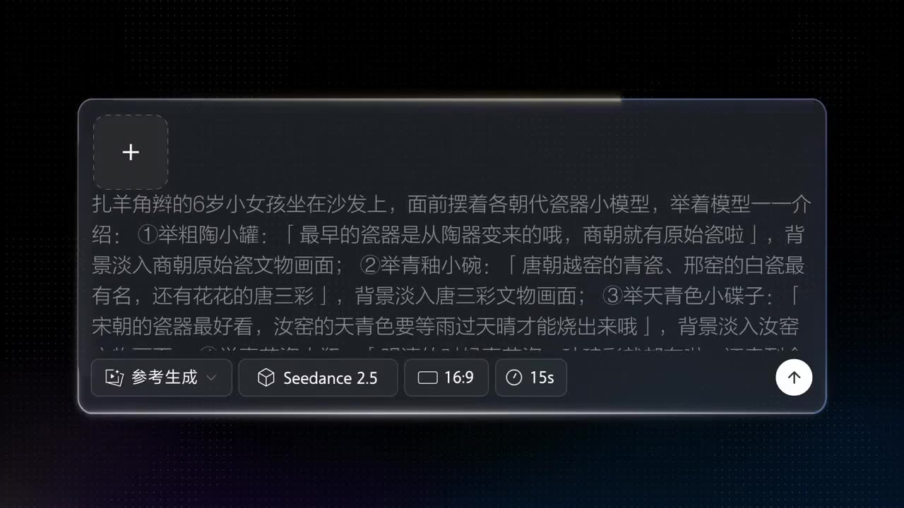

# Live-Action Knowledge Explanation

A real person narrates throughout, naturally demonstrating with physical props, with coherent lip-sync and rhythm.

**Category** · City & street &nbsp;·&nbsp; **Position** · 137 of the atlas &nbsp;·&nbsp; **Source** · community pick

## Try it

- [Read the prompt page](https://callirra.com/seedance-prompt-library/child-explains-porcelain) — the shot explained, with its settings
- [Open it in the generator](https://callirra.com/seedance2.5?atlas=child-explains-porcelain&utm_source=github&utm_medium=atlas) — fills the prompt and every setting below; nothing is submitted until you press generate

## Clip

[](output.mp4)

[Watch the clip](output.mp4) — `output.mp4` in this folder, compressed from the original for the web. The same clip plays on [the prompt page](https://callirra.com/seedance-prompt-library/child-explains-porcelain).

## Settings

| | |
|---|---|
| **Mode** | Text to video |
| **Duration** | 5s |
| **Resolution** | 720p |
| **Aspect ratio** | 16:9 |
| **Audio** | on |
| **Credits** | 195 |

> These are a starting point rather than a record: the original settings were not published.

## Prompt

```text
A 6-year-old girl with pigtails sits on a sofa, with small models of porcelain from various dynasties placed in front of her. She holds up the models one by one to introduce them: ① Holds a coarse pottery jar: 'The earliest porcelain evolved from pottery. Primitive porcelain existed as early as the Shang Dynasty.' Background fades in a scene of Shang Dynasty primitive porcelain artifacts. ② Holds a celadon-glazed small bowl: 'The celadon from the Yue Kiln and the white porcelain from the Xing Kiln were most famous in the Tang Dynasty, and there were also colorful Tang Sancai.' Background fades in a scene of Tang Sancai artifacts. ③ Holds a sky-blue small dish: 'Porcelain from the Song Dynasty is the most beautiful. The sky-blue color of Ru Kiln ware could only be fired after the rain cleared and the sky turned blue.' Background fades in a scene of Ru Kiln artifacts. ④ Holds a blue-and-white porcelain small vase: 'During the Ming and Qing dynasties, blue-and-white porcelain and enamel colors were all available, and they were sold all over the world.' Background fades in a scene of blue-and-white porcelain artifacts. Finally, the little girl holds up her own drawing of blue-and-white porcelain and smiles at the camera, accompanied by light and cheerful children's BGM.
```

## Credit

**ByteDance Seedance** — [original](https://github.com/AtlasCloudAI/awesome-seedance-2.5-prompts-skills#category-30)

Licence: CC BY 4.0

The prompt and the clip above are theirs. We host a copy so this page keeps working if the original
goes away, and the link above points at the source. Rights holder and want it removed? Open an issue
and it comes down.


## Keywords

`urban city` · `seedance 2.5 prompt` · `ai video prompt`

---

<sub>From the [Seedance 2.5 Prompt Atlas](https://callirra.com/seedance-prompt-library) · CC BY 4.0 · the credit figure is the live price the generator charges for exactly this configuration.</sub>
