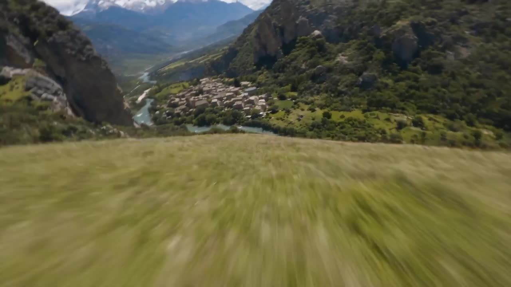

# First-Person Drone Flight

A first-person FPV drone racing perspective, cinematic single shot, flying through dynamic landscapes.

**Category** · City & street &nbsp;·&nbsp; **Position** · 140 of the atlas &nbsp;·&nbsp; **Source** · community pick

## Try it

- [Read the prompt page](https://callirra.com/seedance-prompt-library/fpv-drone-city-race) — the shot explained, with its settings
- [Open it in the generator](https://callirra.com/seedance2.5?atlas=fpv-drone-city-race&utm_source=github&utm_medium=atlas) — fills the prompt and every setting below; nothing is submitted until you press generate

## Clip

[](output.mp4)

[Watch the clip](output.mp4) — `output.mp4` in this folder, compressed from the original for the web. The same clip plays on [the prompt page](https://callirra.com/seedance-prompt-library/fpv-drone-city-race).

## Settings

| | |
|---|---|
| **Mode** | Text to video |
| **Duration** | 25s |
| **Resolution** | 720p |
| **Aspect ratio** | 16:9 |
| **Audio** | on |
| **Credits** | 971 |

> These are a starting point rather than a record: the original settings were not published.

## Prompt

```text
Overall setting: First-person FPV racing drone perspective, cinematic live-action quality, single continuous shot without cuts, total duration 25 seconds. Sunny day, clear blue sky, realistic lighting and atmospheric perspective. The lens always faces the drone's forward direction, high speed with slight body tilt and inertial sway. Spatial relationships strictly follow the red line one-way progression: starting point (lower left hillside) → waterfall top ① → waterfall bottom → village ② → gap between two distant mountains ③ → distant valley vista, always forward, no turning back, no reverse flight, no returning to start.
Motion path (connected sequentially):
The drone starts low from a green hillside at the lower left of the canyon, accelerates climbing close to the slope, flying towards the large waterfall cascading down the left cliff wall; climbs up along the left cliff wall of the waterfall, circles to the top of the waterfall, overlooking the drop point and source stream from above (corresponding to marker ①).
After passing the waterfall top, the drone lowers its nose, dives down along the outer cliff wall of the waterfall, skimming the edge of the splashing water mist (not entering the water curtain), descending to just above the river surface at the waterfall base; then turns right, flying at high speed along the winding river in a smooth wave pattern, skimming over the roofs of a stone house village in the middle of the valley (corresponding to marker ②).
After passing through the village, continue deeper along the river valley to the right, charging at full speed towards the two highest mountains in the distance, passing precisely through the center of the V-shaped gap between the two peaks (corresponding to marker ③), exiting the frame into an open distant valley vista, ending steadily.
Negative constraints: No on-screen text / markers / red line / numbering; do not pass through the water curtain head-on, do not fly into the water mist; do not fly backwards, no unnecessary hovering or stalling; weather and lighting consistent throughout; total duration strictly 25 seconds, no black screens or accelerated jump cuts mid-way.
Generate a 15-second first-person FPV perspective ultra-high-speed drone穿梭 video, cinematic, single continuous shot. The shot starts from a low-altitude point near the Huangpu River surface / the base of the Oriental Pearl TV Tower, first rapidly ascends and smoothly circles around the tower body, lower sphere, upper sphere, and antenna spire of the Oriental Pearl, then according to the spatial relationship of the red line trajectory in the image,高速飞越 the Huangpu River, charges towards the Lujiazui financial district,穿梭 left and right,起伏 up and down between the Shanghai Tower, Shanghai World Financial Center (SWFC), and Jin Mao Tower trio, finally follows the direction of the arrow in the image, (but do not show the red line, it's only for guidance)冲刺 towards the right front of the Pudong skyline, ending in an open distant city vista.
Generate a 15-second first-person FPV perspective ultra-high-speed drone穿梭 video, cinematic, single continuous shot. The shot starts from a low-altitude point near the base of Tokyo Tower, first rapidly ascends and smoothly circles around the red-and-white tower body, main observatory, and spire of Tokyo Tower, then according to the spatial relationship of the red line trajectory in the image,高速掠过 the dense city rooftops of Minato and Shibuya wards, charges towards the Shinjuku skyscraper cluster,穿梭 left and right,起伏 up and down between the Metropolitan Government Building, Mode Gakuen Cocoon Tower, and glass-curtain-wall high-rises, finally follows the direction of the arrow in the image towards the right front of the Shinjuku skyline, ending in a distant Tokyo vista under golden黄昏余晖. (But do not show the red line, it's only for guidance)
```

## Credit

**ByteDance Seedance** — [original](https://github.com/AtlasCloudAI/awesome-seedance-2.5-prompts-skills/blob/main/i18n/README_zh.md)

Licence: CC BY 4.0

The prompt and the clip above are theirs. We host a copy so this page keeps working if the original
goes away, and the link above points at the source. Rights holder and want it removed? Open an issue
and it comes down.


## Keywords

`urban city` · `seedance 2.5 prompt` · `ai video prompt`

---

<sub>From the [Seedance 2.5 Prompt Atlas](https://callirra.com/seedance-prompt-library) · CC BY 4.0 · the credit figure is the live price the generator charges for exactly this configuration.</sub>
