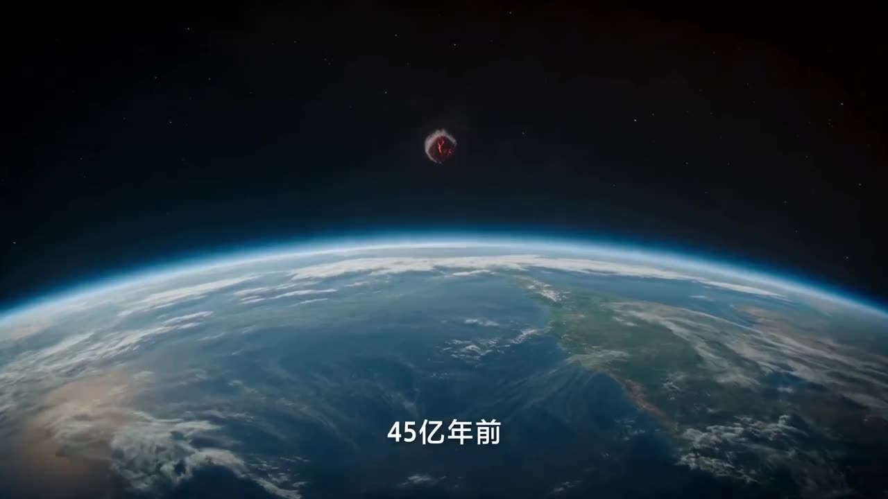

# Astronomy Knowledge Visualization

Transforming abstract principles into continuous visual videos.

**Category** · Story & dialogue &nbsp;·&nbsp; **Position** · 162 of the atlas &nbsp;·&nbsp; **Source** · community pick

## Try it

- [Read the prompt page](https://callirra.com/seedance-prompt-library/astronomy-knowledge-visualization) — the shot explained, with its settings
- [Open it in the generator](https://callirra.com/seedance2.5?atlas=astronomy-knowledge-visualization&utm_source=github&utm_medium=atlas) — fills the prompt and every setting below; nothing is submitted until you press generate

## Clip

[](output.mp4)

[Watch the clip](output.mp4) — `output.mp4` in this folder, compressed from the original for the web. The same clip plays on [the prompt page](https://callirra.com/seedance-prompt-library/astronomy-knowledge-visualization).

## Settings

| | |
|---|---|
| **Mode** | Text to video |
| **Duration** | 21s |
| **Resolution** | 720p |
| **Aspect ratio** | 16:9 |
| **Audio** | on |
| **Credits** | 816 |

> These are a starting point rather than a record: the original settings were not published.

## Prompt

```text
Generate a science popularization video explaining how the Moon was born. The visual quality should have a cinematic feel, with strong visual effects and visual tension during the explosion/convergence process. It must conform to facts and follow scientific basis. 0-2s: Distant space view, the Earth's arc and blue atmosphere at the bottom of the frame, a small dark red celestial body suspended in the black universe far above, the camera is mostly still, slowly showing the distance relationship between Earth and the body. 2-3s: Cut to a close-up, a huge celestial body covered with orange-red lava cracks approaches the edge of Earth, Earth's atmosphere forms a blue arc at the bottom right, the camera is still, the celestial body's sense of oppression increases. Dialogue: 4.5 billion years ago, Earth was struck by a Mars-sized celestial body. 3-5s: The lava celestial body impacts the edge of Earth, intense white-orange burst of light erupts from the contact point, a large amount of hot debris and flames scatter outward along Earth's surface, the camera follows the explosion shockwave continuously pushing forward. 5-8s: The hot material after the impact converges into a glowing orange-red molten sphere in space, surrounded by swirling debris and dust, one side of Earth is visible in the background, the camera slowly pulls back from close to far. 8-10s: A glowing ring of molten material and debris belt appears next to Earth, orange-red material distributes around Earth's orbit, black space background, the camera maintains a distant observation view. Dialogue: The impact partially melted both, and material was flung into Earth's orbit. 10-12s: Cut to a close-up of the lunar surface, gray cratered terrain covered with orange-red molten cracks, scattered rocks and dust, the scene gradually transitions from hot cracks to a cooled gray surface. 12-14s: The gray lunar surface continues to form, the cratered landscape becomes more stable, the edge and dark side of the Moon appear on the right side of the frame, the camera slowly pulls back, showing the Moon aggregating from the debris. Dialogue: The debris aggregated into the Moon over tens of millions of years. The moon above your head is the product of this impact. 14-21s: Earth and the Moon are in the same frame, the camera pulls back, the Moon moves away from Earth. A ruler appears between Earth and the Moon, with numbers continuously growing on the ruler. Dialogue: It is still moving away from Earth at a rate of 3.8 centimeters per year.
```

## Credit

**ByteDance Seedance**

Licence: CC BY 4.0

The prompt and the clip above are theirs. We host a copy so this page keeps working if the original
goes away, and the link above points at the source. Rights holder and want it removed? Open an issue
and it comes down.


## Keywords

`story dialogue` · `seedance 2.5 prompt` · `ai video prompt`

---

<sub>From the [Seedance 2.5 Prompt Atlas](https://callirra.com/seedance-prompt-library) · CC BY 4.0 · the credit figure is the live price the generator charges for exactly this configuration.</sub>
