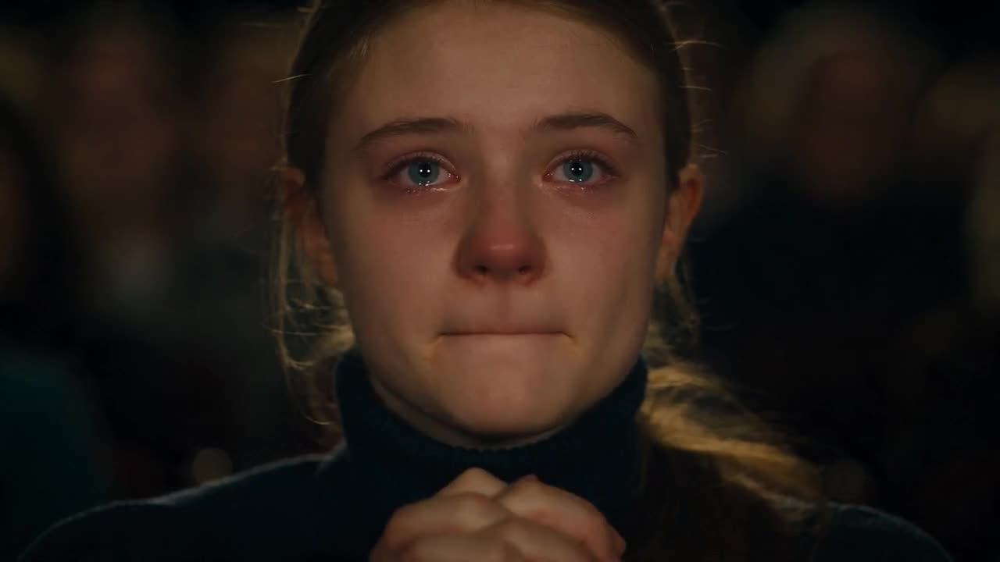

# Complex Emotions In Theater Audience

A young girl in a theater audience watches a performance with a mix of pride, heartache, and suppressed tears.

**Category** · Story & dialogue &nbsp;·&nbsp; **Position** · 171 of the atlas &nbsp;·&nbsp; **Source** · community pick

## Try it

- [Read the prompt page](https://callirra.com/seedance-prompt-library/theatre-audience-emotion) — the shot explained, with its settings
- [Open it in the generator](https://callirra.com/seedance2.5?atlas=theatre-audience-emotion&utm_source=github&utm_medium=atlas) — fills the prompt and every setting below; nothing is submitted until you press generate

## Clip

[](output.mp4)

[Watch the clip](output.mp4) — `output.mp4` in this folder, compressed from the original for the web. The same clip plays on [the prompt page](https://callirra.com/seedance-prompt-library/theatre-audience-emotion).

## Settings

| | |
|---|---|
| **Mode** | Text to video |
| **Duration** | 5s |
| **Resolution** | 720p |
| **Aspect ratio** | 16:9 |
| **Audio** | on |
| **Credits** | 195 |

> These are a starting point rather than a record: the original settings were not published.

## Prompt

```text
Theater audience, a young girl with her hands clasped near her chin, gazing at the performance on stage. Her emotions are complex and mixed; there is pride in her eyes, heartache, and the glimmer of suppressed tears. Her lips are lightly pressed together, her eyelashes tremble, tears well up in her eyes but she forces them not to fall. The core presentation is the authentic, mixed feelings of watching someone dearest to you shine.
```

## Credit

**ByteDance Seedance** — [original](https://github.com/AtlasCloudAI/awesome-seedance-2.5-prompts-skills/blob/main/i18n/README_zh.md)

Licence: CC BY 4.0

The prompt and the clip above are theirs. We host a copy so this page keeps working if the original
goes away, and the link above points at the source. Rights holder and want it removed? Open an issue
and it comes down.


## Keywords

`story dialogue` · `seedance 2.5 prompt` · `ai video prompt`

---

<sub>From the [Seedance 2.5 Prompt Atlas](https://callirra.com/seedance-prompt-library) · CC BY 4.0 · the credit figure is the live price the generator charges for exactly this configuration.</sub>
