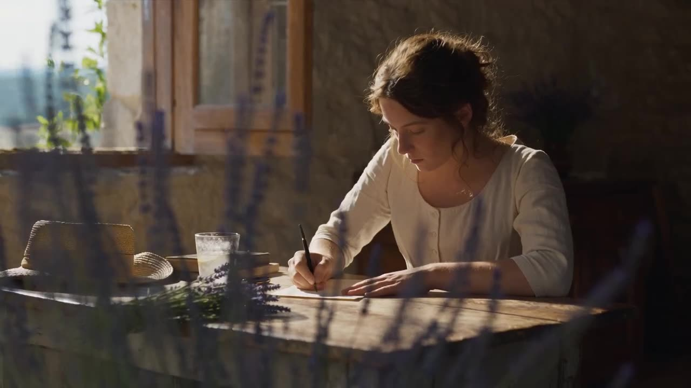

# Wordless Narrative

From writing a letter indoors to posting it, the shots transition from shallow depth-of-field to a golden valley panorama, maintaining a consistent mood.

**Category** · Story & dialogue &nbsp;·&nbsp; **Position** · 172 of the atlas &nbsp;·&nbsp; **Source** · community pick

## Try it

- [Read the prompt page](https://callirra.com/seedance-prompt-library/wordless-letter) — the shot explained, with its settings
- [Open it in the generator](https://callirra.com/seedance2.5?atlas=wordless-letter&utm_source=github&utm_medium=atlas) — fills the prompt and every setting below; nothing is submitted until you press generate

## Clip

[](output.mp4)

[Watch the clip](output.mp4) — `output.mp4` in this folder, compressed from the original for the web. The same clip plays on [the prompt page](https://callirra.com/seedance-prompt-library/wordless-letter).

## Settings

| | |
|---|---|
| **Mode** | Text to video |
| **Duration** | 30s |
| **Resolution** | 720p |
| **Aspect ratio** | 16:9 |
| **Audio** | on |
| **Credits** | 1165 |

> These are a starting point rather than a record: the original settings were not published.

## Prompt

```text
A 30-second wordless visual story, imbued with the quiet elegance of the French countryside, set on a summer afternoon in Provence. A young woman in a beige linen dress finishes writing a letter by hand at an old wooden table in a stone cottage, then steps outside, walks along a gravel path through a sunflower field, and gently slips the letter into a vintage yellow mailbox at the village edge. The shot begins with a shallow depth-of-field close-up on the indoor table, passes through the doorway—where light gradually gives way to shadow—and finally pulls up and out to reveal a wide panoramic view of the golden valley. Only ambient sounds throughout—cicadas, wind, the rustle of pen on paper, and the soft click of the mailbox closing—like the lingering silence after sending a letter to a distant place.
```

## Credit

**ByteDance Seedance** — [original](https://github.com/AtlasCloudAI/awesome-seedance-2.5-prompts-skills/blob/main/i18n/README_zh.md)

Licence: CC BY 4.0

The prompt and the clip above are theirs. We host a copy so this page keeps working if the original
goes away, and the link above points at the source. Rights holder and want it removed? Open an issue
and it comes down.


## Keywords

`story dialogue` · `seedance 2.5 prompt` · `ai video prompt`

---

<sub>From the [Seedance 2.5 Prompt Atlas](https://callirra.com/seedance-prompt-library) · CC BY 4.0 · the credit figure is the live price the generator charges for exactly this configuration.</sub>
